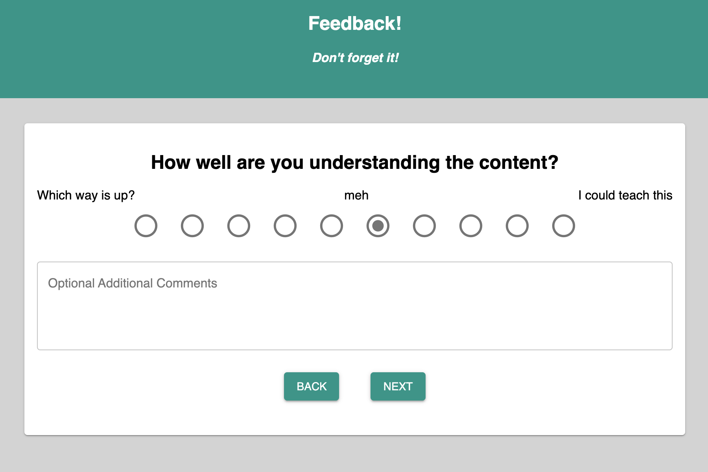

# Redux Feedback Loop

## [Demo](http://feedback.mynameisjon.com/)

## Description
Duration: Weekend Project

A portal for submitting daily student feedback.

## Screen Shot

## Prerequisites

[Node.js](https://nodejs.org/en/)

[PostgreSQL](https://www.postgresql.org/)

## Installation
1. Create a database named `prime_feedback`
2. Use the queries in `data.sql` to set up the tables.
3. From the base directory in your terminal run `npm install` to grab the necessary dependencies. This may take some time.
4. Run `npm run server`
5. In another terminal instance run `npm run client`, the site will load in your default browser. Follow the prompts in your terminal if it cannot determine the default.

## Usage
- For each of 3 categories the student is required to input a 1-10 score. The student will be directed back to a section if they do not input a score.

- The student may also leave comments for each section, as well as general comments on a 4th page.

- Before submission the user is presented with a review of their entries and may navigate using the back buttons to make any changes.

- Upon completion they are given an option to return to the beginning to submit feedback for the next day.

- All feedback collected is visible at `/#/admin`

## Built With
- React
- Material-UI
- javascript
- express
- node.js
- postgreSQL